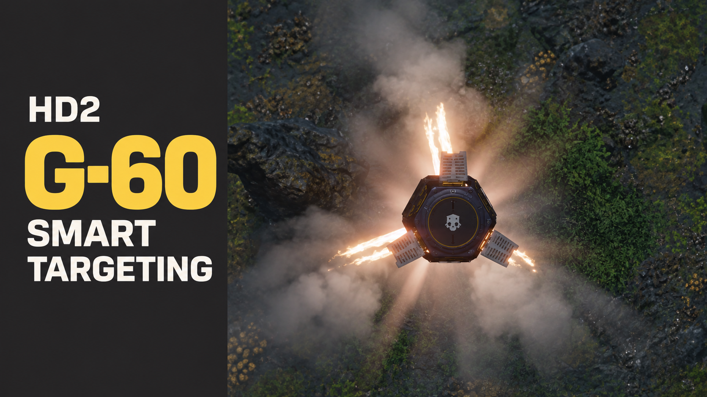

# HD2 G-60 Smart Targeting



[繁體中文](README.zh-TW.md) · **0.1 beta.1** · [Downloads](https://github.com/etxp/HD2-G60-Smart-Targeting/releases)

G-60 targeting for selected Terminid heavies, with tuned attack positions and one grenade assigned to each target.
Mark a supported bug hole, Shrieker Nest, Spore Spewer or objective egg sack to send a grenade there first,
including a grenade already flying toward an enemy.

## Behavior

- Automatic priority: **Bile Titan = Dragonroach > Impaler > Spore Charger > Charger Behemoth > Charger**.
- Only the specifically supported enemy variants are eligible. Ordinary small bugs are ignored.
- A target stays reserved until its assigned grenade disappears. Other grenades choose another eligible target or orbit.
- Your own structure marks override enemy targeting. The latest eligible mark has priority and is remembered after the UI marker expires.
- Enemy-mark priority is currently disabled. Unmarked structures, teammate marks and ordinary ground pings do not trigger structure attacks.
- Grenades use adjusted approach routes and arrival checks. Unsuccessful approaches return to search;
  the 30-second flight limit removes the grenade without a timeout explosion.

The addon still depends on the game's available enemy candidates and visibility behavior; it is not a global enemy scanner.
See [supported targets and attack sites](docs/TARGETS.md).

## Install

1. Close the game and install [Bingus Shared Loader](https://github.com/CowboyBingus/BingusSharedLoader), API 1 with addon discovery (v15+).
2. Download **HD2-G60-Smart-Targeting-0.1-beta.1.zip** from Releases and import it into your mod manager.
   The source ZIP is for development, not installation.
3. Disable older G-60 packages, enable this version, and Purge / Deploy before restarting the game.

To uninstall, disable this addon, Purge / Deploy, and restart. The existing mod GUID and Lua resource identity are preserved.
The runtime log is `G60SmartTargeting.log` in the loader's log directory.
Beta.1 makes diagnostic logging optional. Missing or failed log files no longer prevent startup or operation.
The runtime identifies itself as `version=0.5.20-experimental`.

## Beta status

The author has confirmed the enemy filtering, priority/allocation behavior, tuned enemy attacks and normal/large bug-hole explosions in gameplay.
Objective egg targeting is implemented and covered by isolated tests, but has not yet received separate gameplay confirmation.
Shrieker Nest and Spore Spewer destruction also remain unconfirmed. These are not guaranteed one-grenade kills.

This version uses original native calls with build signatures and identity/ownership checks. It contains no executable-memory patches,
hooks or injected custom DLL. Complete native lifetime/cadence proof remains unfinished (`native_lifetime_verified=false`).
Future game updates may make the checks refuse activation; compatibility across updates is not promised.

## Build and contribute

Python 3.10+ builds the addon without a game installation or external packager. LuaJIT and/or Lua run the portable tests.

```sh
python -B scripts/check.py
python -B scripts/build.py
```

The public build reproduces the tested deployment files byte for byte. See [building](docs/BUILDING.md),
[validation](docs/VALIDATION.md), [compatibility](docs/COMPATIBILITY.md) and [contributing](CONTRIBUTING.md).

Maintained by **etxp**, with AI-assisted development and artwork editing.
Authored code and documentation use the [MIT license](LICENSE); game-derived data and artwork have separate rights described in
[third-party notices](THIRD_PARTY_NOTICES.md). Both [16:9](assets/cover-16x9.png) and [4:3](assets/cover-4x3.png) covers are available.
